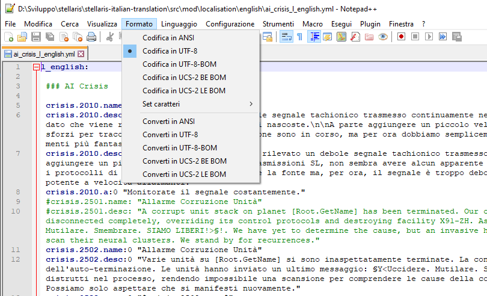
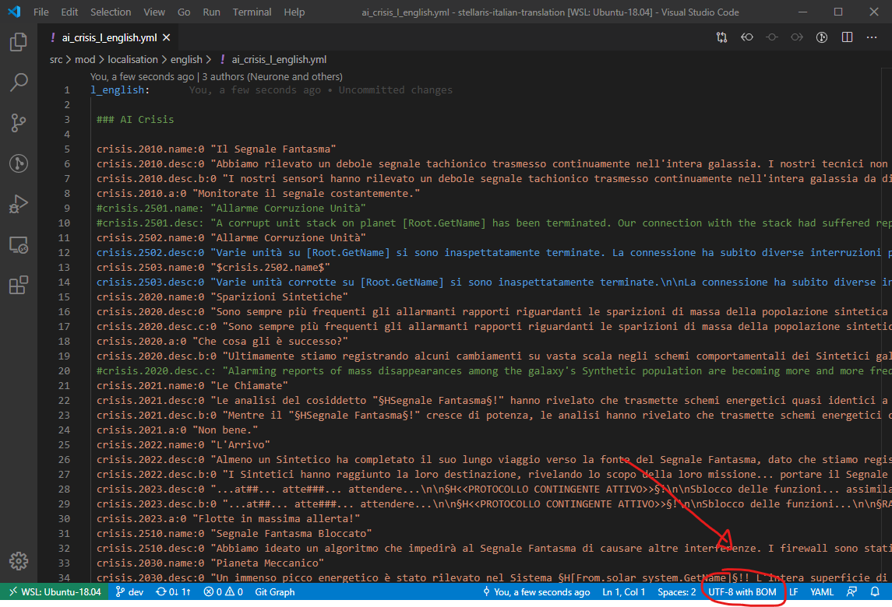
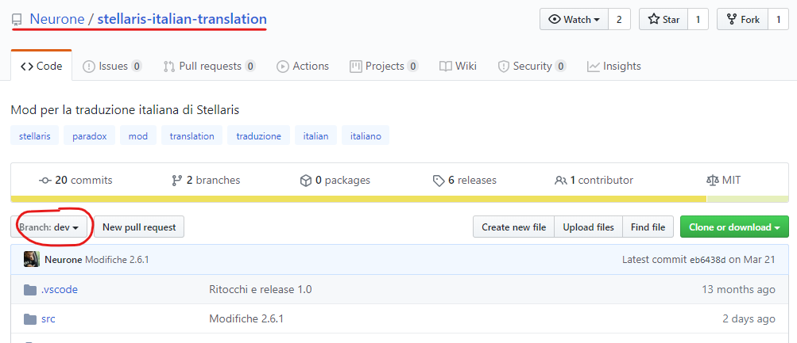
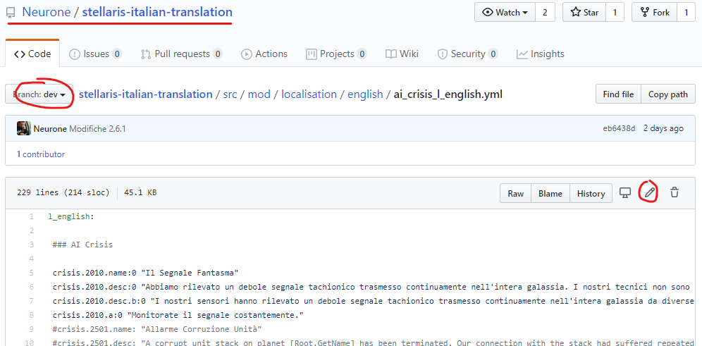
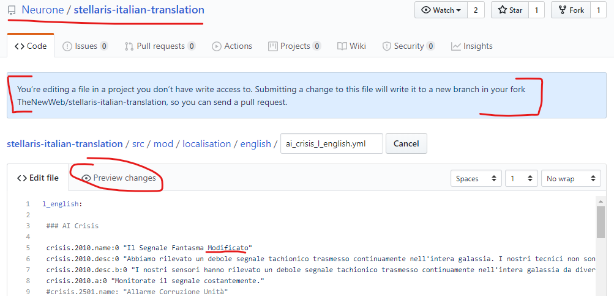
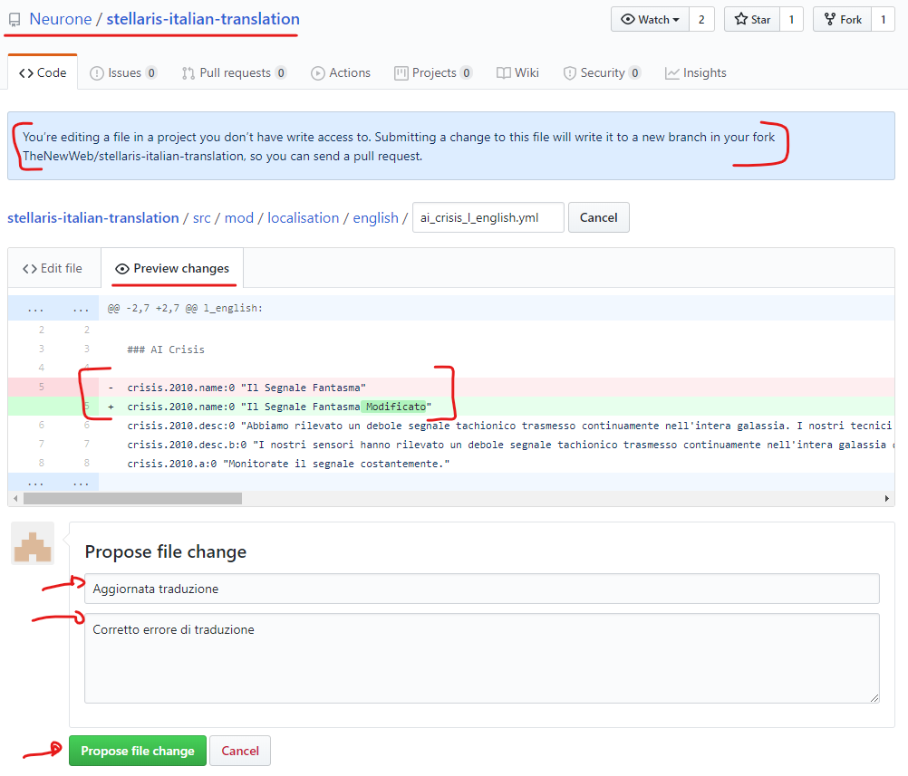
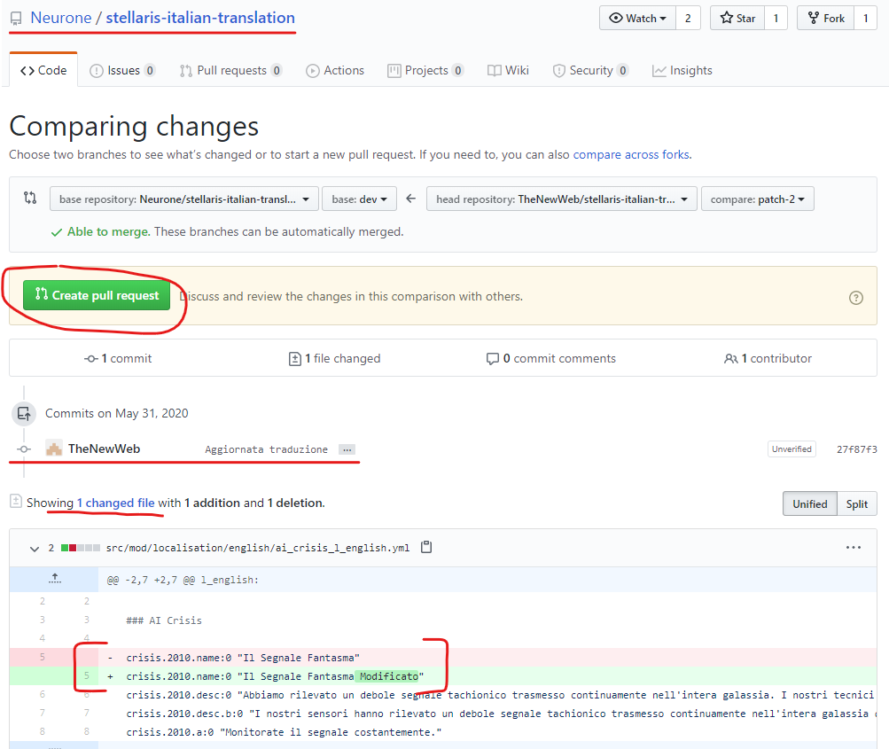
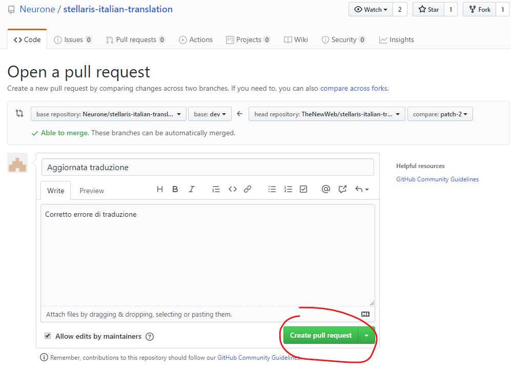
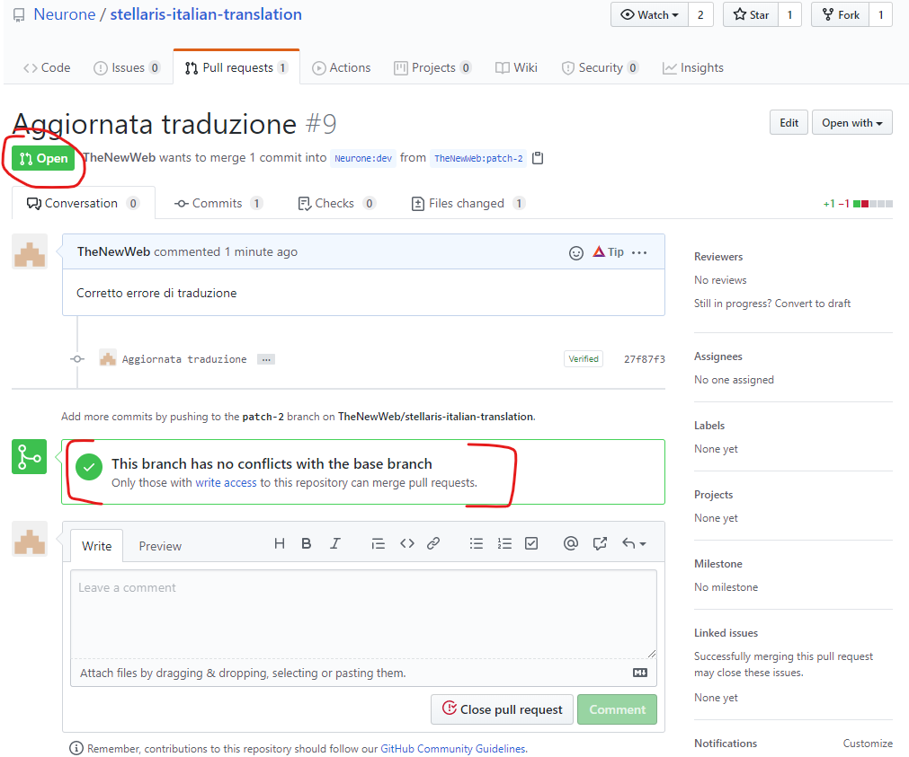
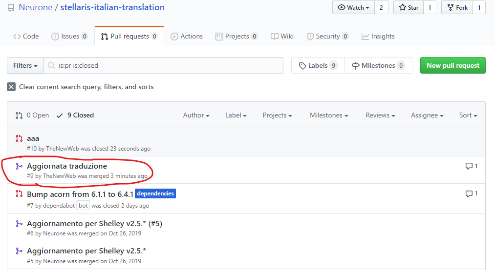

# Traduzione italiana di Stellaris

Questo mod, **compatibile** con la **modalità Ironman** e gli **achievement di Steam**, sostituisce la lingua inglese con la lingua italiana.

Basato sulla versione: **Cepheus v3.4.3**

Di seguito trovate l'attuale stato di traduzione del gioco base e dei DLC, ordinati per data di uscita.

| Uscita | DLC | Stato Traduzione |
|--|--|--|
|2022.05.12| Overlord| **Da tradurre**|
|2021.11.22| Pacchetto Specie - Aquatics| Completa|
|2021.04.15| Nemesis| **Parziale**|
|2020.10.29| Pacchetto Specie - Necroids| Completa|
|2020.03.17| Federations| **Parziale**|
|2019.10.24| Pacchetto Specie - Lithoids| Completa|
|2019.06.04| Pacchetto Narrativo - Ancient Relics| Completa|
|2018.12.06| MegaCorp| Completa, **in revisione**|
|2018.05.22| Pacchetto Narrativo - Distant Stars| Completa|
|2018.02.22| Apocalypse| Completa|
|2017.12.07| Pacchetto Specie - Humanoids| Completa|
|2017.09.21| Pacchetto Narrativo - Synthetic Dawn| Completa|
|2017.04.06| Utopia| Completa|
|2016.10.20| Pacchetto Narrativo - Leviathans| Completa|
|2016.08.04| Pacchetto Specie - Plantoids| Completa|
|2016.05.09| Stellaris Base| Completa, **in revisione**|

Per facilitare il confronto con il resto del mondo, **non sono tradotti volutamente i nomi degli achievement ma solo la loro descrizione**.

Grazie a tutta la comunità per i contributi alle traduzioni, e in particolare a [Nefando](https://github.com/Nefando), [AndryRock](https://github.com/AR-9217), [Daddie2](https://github.com/Daddie2) e [anthx80](https://github.com/anthx80).

Ricordo infine che ho creato questo mod a maggio 2019 partendo dai testi diligentemente tradotti dal team Battle of Paradox Italia, ed in particolare dal buon [Puxxup](url=https://steamcommunity.com/profiles/76561198030059915), perché volevo creare una versione compatibile con Ironman e achievement di Steam. Tanta acqua è passata sotto i ponti, nuovi DLC sono usciti, molte traduzioni sono state revisionate e aggiunte, e il mod ha preso quindi da tempo una strada tutta sua, ma è sempre bene ricordare le proprie origini, ed è per questo che troverete citati nei credits in-game anche il team BoPI, Puxxup e diversi altri traduttori.

## Contribuire alla traduzione

**Lo strumento principale per contribuire al progetto è [Transifex](https://www.transifex.com/internet-of-peers/stellaris-italian-translation)**.

Potete utilizzare comunque anche Github e proporre direttamente pull request su questo repository: utilizzate le informazioni riportate di seguito riportate per maggiori dettagli su come fare. 

Paradox aggiorna spesso i propri prodotti, non solo aggiungendo nuovi DLC e nuovi dialoghi, ma anche correggendo dove e quando serve quelli vecchi. Questo significa che è difficile avere una traduzione sempre aggiornata al 100% all'ultima release, quindi ogni aiuto con le traduzioni è ben accetto :)

Per come è strutturato il gioco, e poiché questo mod vuole mantenere gli achievement attivi, non è possibile aggiungere una lingua al gioco: l'unica alternativa per avere l'italiano è modificare una delle lingue disponibili. Per comodità quindi questo mod sovrascrive direttamente la lingua di default, ossia l'inglese. La fonte principale di frasi da tradurre di trova all'interno della cartella [src/mod/localisation/english](src/mod/localisation/english).

### Stato della traduzione, per file

In precedenza qui tenevo l'elenco dei file in lavorazione, ma sono diventati troppi (161 alla versione 3.43). Per verificare lo stato corrente di ogni file (completato, in revisione, da tradurre, ecc.) è possibile verificare direttamente le traduzioni dal [progetto Transifex](https://www.transifex.com/internet-of-peers/stellaris-italian-translation/content/)

### Cosa posso modificare su Github?

Tutto quello che trovate qui su GitHub all'interno del percorso [src/mod](/src/mod) è già traducibile senza rischi di disattivare la modalità Ironman e gli achievement.

Se dovesse servire invece aggiungere un file non ancora presente su questo repository, prima di modificarlo bisogna assicurarsi che non sia incluso nella lista di file che vengono controllati all'avvio del gioco.

Il file che indica a Stellaris la lista dei file _intoccabili_ si chiama `checksum_manifest.txt` e si trova all'interno della cartella principale di gioco. Attualmente il contenuto del file è il seguente:

```txt
directory 
name = common
sub_directories = yes
file_extension = .txt

directory 
name = common
sub_directories = yes
file_extension = .lua

directory
name = common
sub_directories = yes
file_extension = .csv

directory
name = events
sub_directories = yes
file_extension = .txt

directory
name = map
sub_directories = yes
file_extension = .lua

directory
name = map
sub_directories = yes
file_extension = .txt

directory
name = localisation_synced
sub_directories = yes
file_extension = .yml
```

Prendendo ad esempio la prima sezione, significa che all'avvio del gioco verranno controllati tutti i file `.txt` all'interno della cartella `common` e tutte le sue sotto cartelle. Se anche solo un file di questo tipo viene modificato, il controllo fallisce e il gioco impedisce l'attivazione della modalità Ironman e degli achievement. E lo stesso vale per tutte le altre sezioni indicate nel file di checksum.

### Chiavi e valori

Ogni file contiene delle stringhe formate da una chiave, uguale per ogni linguaggio, e dalla sua traduzione corrispondente. Es. all'interno del file [ai_crisis_l_english.yml](src/mod/localisation/english/ai_crisis_l_english.yml) si trova la linea:

```yml
crisis.2010.name:0 "Il Segnale Fantasma"
```

In questo caso `crisis.2010.name` è la chiave, `0` è la versione (in caso di aggiornamenti alla chiave la versione viene incrementata), mentre `"Il Segnale Fantasma"` è la traduzione. Da notare i doppi apici `"` che delimitano il valore vero e proprio della traduzione, in questo caso già tradotto.

### Commenti

Le linee che iniziano con il carattere speciale `#` sono dei commenti o delle frasi non più utilizzate. **Non sono da tradurre** perché non verranno mai visualizzate all'interno del gioco.

### Una riga, una traduzione

Non andate a capo durante la traduzione di un testo. Se serve andare a capo, si utilizza il doppio carattere speciale `\n\n` Lo vedrete utilizzare anche nella frase originale inglese, ma potrete usare il carattere per andare a capo in italiano dove preferite, non necessariamente nella stessa posizione della frase originale.

### Caratteri speciali

Alcune frasi contengono caratteri speciali quali `§H` oppure `§!`. **Non devono essere tradotti o rimossi**, il gioco li utilizza per dare enfasi alle frasi del gioco. Immaginate come se fossero dei delimitatori per le parole da mettere in grassetto, con `§H` che significa inizio grassetto e `§!` fine grassetto

### Variabili

Alcune frasi contengono delle variabili che possono essere racchiuse tra parentesi quadre - ad esempio `[Root.Capital.GetName]` - o dal carattere del dollaro - ad esempio `$ancrel.8010.intro$`. Queste parole **non vanno tradotte**: il gioco le sostituirà automaticamente in tempo reale con il valore corretto. **NOTA:** Alcune variabili in italiano vi creeranno problemi, in particolare tutte quelle che prevedono un articolo davanti, perché in italiano non sappiamo esattamente quale usare in anticipo. Prendete ad esempio la seguente frase:

```yml
mirror_trade_reply:0 "I was about to suggest that myself, for the benefit of all [Root.Owner.Species.GetNamePlural]!"
```

La traduzione corretta sarebbe:

```yml
mirror_trade_reply:0 "Stavo per suggerirlo io stesso, a beneficio di tutti/e i/gli/le [Root.Owner.Species.GetNamePlural]!"
```

Come potete notare, in inglese `the`, `of all`, ecc. funzionano praticamente sempre bene per tutto - _...of all Humanoids_, _...of all Reptilians_, ecc. - ma in italiano la specie potrebbe essere ad esempio "i Rettiliani", "gli Umanoidi", ecc. E questo solo per citare le specie esistenti e definite all'interno del file [name_lists_l_english.yml](src/mod/localisation/english/name_lists_l_english.yml). Ma in questo gioco anche l'utente può definire le sue specie personalizzate, quindi non lo sapremo mai con certezza a priori. Il gioco possiede variabili per il singolare e il plurale, ma non ad esempio per la differenza tra gli articoli da utilizzare.

Una possibile soluzione è quella di prenderci qualche libertà durante la traduzione e scrivere ad esempio:

```yml
mirror_trade_reply:0 "Stavo per suggerirlo io stesso, a beneficio di tutto il popolo [Root.Owner.Species.GetAdj]!"
```

In questo caso non solo ho aggiunto la parola `popolo`, ma ho usato la variabile utilizzata per definire l'aggettivo caratteristico della specie. All'interno del gioco quindi questa frase verrebbe tradotta con `popolo Rettiliano` o `popolo Umanoide`.

In generale, se vi trovate in una impasse sulla possibile traduzione, provate a vedere come è stato fatto in altri punti e seguite la stessa strada. Altrimenti aprite una segnalazione sul repo e discutiamo delle possibili traduzioni.

### Codifica dei caratteri

**La codifica dei caratteri (charset) deve essere UTF-8 con BOM**. Per sicurezza utilizzate direttamente un editor di testo che supporti più charset come ad esempio [Notepad++](https://notepad-plus-plus.org/downloads/) e il charset corretto verrà riconosciuto senza problemi.

Da notare inoltre che i file di testo possono utilizzare dei caratteri speciali all'inizio per determinare l'ordine di scrittura dei byte (il [BOM](https://it.wikipedia.org/wiki/Byte_Order_Mark)). Usando il metodo del _copia e incolla_ questo dettaglio è trascurabile, e solitamente anche se si modificano file esistenti l'editor non tocca il BOM se è presente. Se avete comunque un editor che vi permette di scegliere se applicare o meno il BOM, es. Notepad++ o Visual Studio Code, optate sempre per mantenerlo.





### Ok, capito, ma come modifico i file?

Per contribuire alle traduzioni, potete clonare questo repository, aggiornare direttamente i file e poi procedere con una pull request per effettuare l'unione del vostro repository con quello principale.

Se non siete pratici di `git`, il mio suggerimento è di diventarlo :) È veramente semplice da utilizzare e vi permette di lavorare in locale sul vostro PC.

Un'alternativa, è lavorare comunque sul vostro PC ma effettuare la proposta di modifica direttamente online. Una volta scaricato e tradotto il file che volete aggiornare:

1. Tornate su questo repository, assicuratevi di essere sul ramo **dev**


1. Navigate fino al file che volete aggiornare e premete l'icona in alto a destra per la modifica, la matita che dice "Edit this file"


1. GitHub vi avverte che non avete permessi di scrittura sul repo, che verrà creato un repository uguale a questo sulla vostra utenza e che verrà creato un nuovo ramo con le vostre modifiche. A quel punto, potrete proporre una pull request sul repository principale. Fate una modifica puntuale o, in caso di modifiche multiple, direttamente copia e incolla di tutto il contenuto del vostro file aggiornato


1. premete `Preview changes` per verificare che le modifiche siano quelle che vi aspettate. Se è tutto ok, inserite un messaggio che descrive brevemente la vostra modifica e premete **Propose file change**


1. A questo punto avete aggiornato il vostro repository, e potete procedere con la proposta di unione. Premete il pulsante **Create pull request**, modificate il testo del commit - se per qualche motivo volete cambiare il testo rispetto a quanto avete inserito precedentemente - e poi premete nuovamente **Create pull request** per confermate
 

1. La vostra pull request è stata inoltrata correttamente, risulta in stato aperto (_Open_) e non dovrebbe dare errori di unione (_This branch has no conflicts with the base branch_)


1. Attendete che la PR sia accettata e unita

1. _Opzionale_. Una volta accetta la vostra PR sarà chiusa (_Closed_) e il vostro ramo con la modifica unito (_Merged_) a quello principale. Potete quindi decidere di cancellare il ramo che è rimasto nel vostro repository, visto che ha assolto al proprio compito di proporre la modifica che è stata accettata
 

## Installazione mod da release

Trovate le release già pronte del mod nell'apposita sezione [releases](https://github.com/Neurone/stellaris-italian-translation/releases). Scaricate la release che vi interessa e decomprimetela all'interno della cartella:

```txt
(Windows)   : %USERPROFILE%\Documents\Paradox Interactive\Stellaris\mod
(GNU/Linux) : ~/.local/share/Paradox Interactive/Stellaris/mod
(Mac)       : ~/Documents/Paradox Interactive/Stellaris/mod
```

Nel caso non fosse presente la cartella `mod` potete crearla voi normalmente.

## Creazione mod da codice sorgente

Clonare il repository:

```bash
git clone https://github.com/Neurone/stellaris-italian-translation.git
```

Installare le dipendenze:

```bash
cd stellaris-italian-translation
npm install
```

### Versione release

Creare il mod:

```bash
npm run release
```

L'output sarà simile al seguente:

```bash
> stellaris-italian-translation@2.1.0 release
> npx grunt

Running "clean:init" (clean) task
>> 83 paths cleaned.

Running "copy:release" (copy) task
Created 5 directories, copied 73 files

Running "compress:build" (compress) task
>> Compressed 78 files.

Running "copy:complete" (copy) task
Copied 1 file

Running "compress:release" (compress) task
>> Compressed 2 files.

Running "clean:complete" (clean) task
>> 2 paths cleaned.

Done.
```

Verrà creato il file `stellaris-italian-translation-x.x.x.zip` all'interno della cartella `build\dist`, dove `x.x.x` sarà la versione corrente del mod (in questo esempio `2.1.0`).

Per installare il mod, scompattare il file all'interno della cartella:

```txt
(Windows)   : %USERPROFILE%\Documents\Paradox Interactive\Stellaris\mod
(GNU/Linux) : ~/.local/share/Paradox Interactive/Stellaris/mod
(Mac)       : ~/Documents/Paradox Interactive/Stellaris/mod
```

Nel caso non fosse presente la cartella `mod` potete crearla voi normalmente. La struttura finale dei file sarà la seguente:

```txt
[...]/Paradox Interactive/Stellaris/mod/stellaris-italian-translation.zip (zip con tutte le risorse del mod)
[...]/Paradox Interactive/Stellaris/mod/stellaris-italian-translation.mod (descrittore del mod)
```

### Versione sviluppo o per Workshop Steam

La versione sviluppo del mod è utile per fare modifiche, test o per effettuare il caricamento sul Workshop Steam. **La versione release non permette di fare il caricamento sul Workshop Steam**.

Creare il mod in versione sviluppo:

```bash
npm run dev
```

L'output sarà simile al seguente:

```bash
> stellaris-italian-translation@2.1.0 dev
> npx grunt dev

Running "clean:init" (clean) task
>> 83 paths cleaned.

Running "copy:dev" (copy) task
Created 5 directories, copied 75 files

Running "copy:testing" (copy) task
Created 6 directories, copied 75 files

Done.
```

Verrà creata la cartella `build\dist` e all'interno troverete un file ed una cartella:

```txt
stellaris-italian-translation\*
stellaris-italian-translation.mod
```

Lo script copierà automaticamente tutti file necessari per il test nella cartella dei mod, in particolare:

```txt
(Windows)   : %USERPROFILE%\Documents\Paradox Interactive\Stellaris\mod
(GNU/Linux) : ~/.local/share/Paradox Interactive/Stellaris/mod
(Mac)       : ~/Documents/Paradox Interactive/Stellaris/mod
```

La struttura finale dei file sarà la seguente:

```txt
[...]/Paradox Interactive/Stellaris/mod/stellaris-italian-translation/... (cartella contenente tutte le risorse del mod)
[...]/Paradox Interactive/Stellaris/mod/stellaris-italian-translation.mod (descrittore del mod)
```

## Configurazione di integrazione per Transifex

```yml
filters:
  - filter_type: dir
    file_format: YAML_GENERIC
    source_file_extension: yml
    source_language: en
    source_file_dir: src/transifex-en/
    translation_files_expression: 'src/transifex-<lang>/'
```
